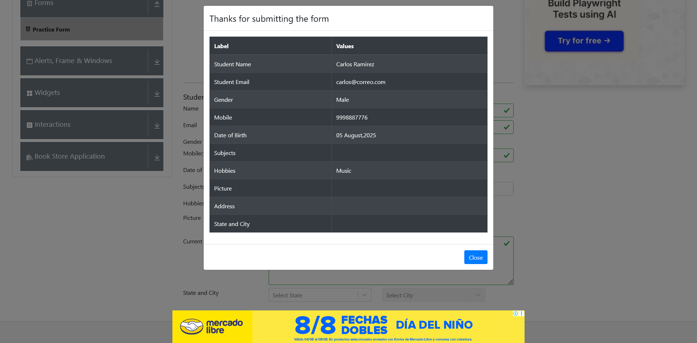

# SENCE-proyecto-2

Integrantes:
 - Jose Astudillo
 - Leslie Aguayo
 - Javier Fuentes

# ⚙️ Instrucciones para ejecutar las pruebas localmente

## ✅ Pre-requisitos

Asegúrate de tener lo siguiente instalado en tu máquina:

- Java JDK 17 o superior
- Apache Maven
- Un IDE (Visual Studio Code, IntelliJ IDEA, etc.)
- GeckoDriver (para Firefox) y ChromeDriver, o utilizar WebDriverManager (ya incluido en el proyecto)

---

## 📦 Clonar el proyecto

```bash
git clone https://github.com/Javitodev1/SENCE-proyecto-2.git
cd SENCE-proyecto-2
```
## Renombrar POM file
Renombrar el archivo por segun corresponda su sistema operativo
```bash
mv pom.xml.linux pom.xml
```

o

```bash
mv pom.xml.window pom.xml
```

## Compilar y descargar dependencias
```bash
mvn clean install
```
## 🚀 Ejecutar un test específico
```bash
mvn -Dtest=Leccion1test test
```
## 📊 Ver resultados
- Las capturas de pantalla en caso de error se guardarán en la carpeta:
```bash
/screenshots
```
- Los logs y los resultados se podrán consultar en:
```bash
/target/surefire-reports
```

## 📌 Presentación del Proyecto de Automatización Funcional

Este proyecto consiste en una suite de pruebas automatizadas construida con **Java**, **Selenium WebDriver** y **TestNG**, enfocada en validar los flujos críticos de una aplicación web con funcionalidades de registro e inicio de sesión.

## 🎯 Objetivo

Validar funcionalmente:
- Registro de usuarios (campos obligatorios, formatos inválidos)
- Inicio de sesión con credenciales válidas e inválidas
- Bloqueo tras múltiples intentos fallidos

## 🧪 Tecnología utilizada
- Java + Maven
- Selenium WebDriver
- TestNG
- WebDriverManager
- Firefox y Chrome

## 📁 Estructura del código
- `pages/`: Clases que representan páginas web (POM)
- `test/`: Clases que contienen los casos de prueba
- `resources/datos/`: Archivos CSV u otras fuentes de datos

## 📊 Resultados
- ✔ 6 combinaciones de datos probadas
- ✔ 4 flujos automatizados
- ✔ Capturas generadas en fallos
- ✔ Pruebas ejecutadas en Chrome y Firefox

## 🎓 Lecciones aprendidas
- Aplicación de POM para mejorar mantenimiento
- Manejo de múltiples navegadores y datos externos
- Importancia de sincronización con WebDriverWait


## 📁 Estructura del proyecto

### Estructura de carpetas

```bash
 src
└── test
    ├── java
    │   ├── com
    │   │   ├── Leccion1test.java
    │   │   ├── Leccion7test.java
    │   │   ├── LoginTest.java
    │   │   ├── PracticeFormTest.java
    │   │   └── RegistroTest.java
    │   └── pages
    │       ├── LoginPage.java
    │       └── RegisterPage.java
    └── resources
        └── datos
            ├── LoginData.xlsx
            └── PracticeFormData.xlsx
```

### Estructura de POM

#### LoginPage

Facilita el proceso de login manejando las siguientes propiedades del formulario

- username
- password
- login

#### RegisterPage

Facilita el proceso de registro manejando las siguientes propiedades del formulario

- newuser
- firstname
- lastname
- username
- password
- register

## ✅ Resultados de las pruebas

### Salida de consola

```bash
[INFO] -------------------------------------------------------
[INFO]  T E S T S
[INFO] -------------------------------------------------------
[INFO] Running TestSuite
SLF4J(W): No SLF4J providers were found.
SLF4J(W): Defaulting to no-operation (NOP) logger implementation
SLF4J(W): See https://www.slf4j.org/codes.html#noProviders for further details.
[INFO] Tests run: 2, Failures: 0, Errors: 0, Skipped: 0, Time elapsed: 17.06 s -- in TestSuite
[INFO] 
[INFO] Results:
[INFO] 
[INFO] Tests run: 2, Failures: 0, Errors: 0, Skipped: 0
[INFO] 
[INFO] ------------------------------------------------------------------------
[INFO] BUILD SUCCESS
[INFO] ------------------------------------------------------------------------
[INFO] Total time:  19.332 s
[INFO] Finished at: 2025-08-05T23:01:53-04:00
[INFO] ------------------------------------------------------------------------
```

### Screenshots de las pruebas




