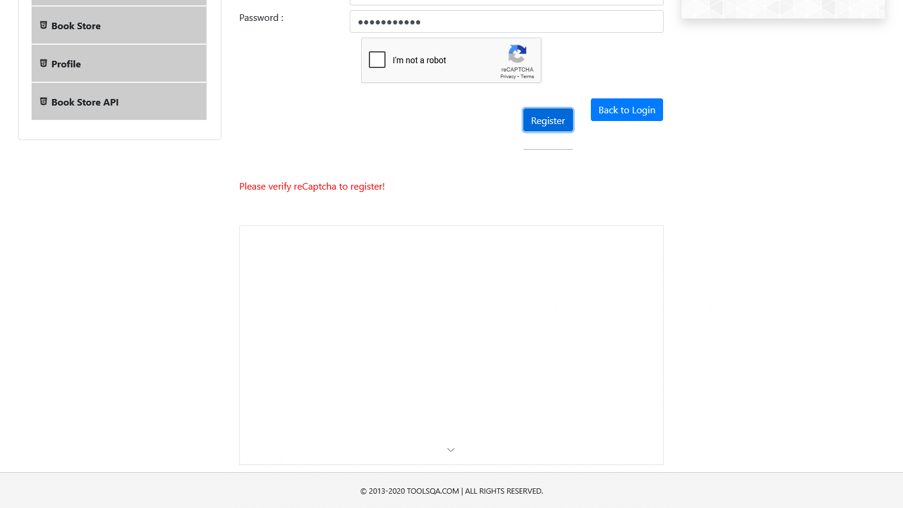

# SENCE-proyecto-2

Integrantes:
 - Jose Astudillo
 - Leslie Aguayo
 - Javier Fuentes

### Estructura del proyecto

## Estructura de carpetas

 src
└── test
    ├── java
    │   ├── com
    │   │   ├── Leccion1test.java
    │   │   ├── Leccion7test.java
    │   │   ├── LoginTest.java
    │   │   ├── PracticeFormTest.java
    │   │   └── RegistroTest.java
    │   └── pages
    │       ├── LoginPage.java
    │       └── RegisterPage.java
    └── resources
        └── datos
            ├── LoginData.xlsx
            └── PracticeFormData.xlsx

### Estructura de POM

#### LoginPage

Facilita el proceso de login manejando las siguientes propiedades del formulario

- username
- password
- login

#### RegisterPage

Facilita el proceso de registro manejando las siguientes propiedades del formulario

- newuser
- firstname
- lastname
- username
- password
- register

## Resultados de las pruebas

### Salida de consola

```bash
[INFO] -------------------------------------------------------
[INFO]  T E S T S
[INFO] -------------------------------------------------------
[INFO] Running TestSuite
SLF4J(W): No SLF4J providers were found.
SLF4J(W): Defaulting to no-operation (NOP) logger implementation
SLF4J(W): See https://www.slf4j.org/codes.html#noProviders for further details.
[INFO] Tests run: 2, Failures: 0, Errors: 0, Skipped: 0, Time elapsed: 17.06 s -- in TestSuite
[INFO] 
[INFO] Results:
[INFO] 
[INFO] Tests run: 2, Failures: 0, Errors: 0, Skipped: 0
[INFO] 
[INFO] ------------------------------------------------------------------------
[INFO] BUILD SUCCESS
[INFO] ------------------------------------------------------------------------
[INFO] Total time:  19.332 s
[INFO] Finished at: 2025-08-05T23:01:53-04:00
[INFO] ------------------------------------------------------------------------
```

### Screenshots de las pruebas


